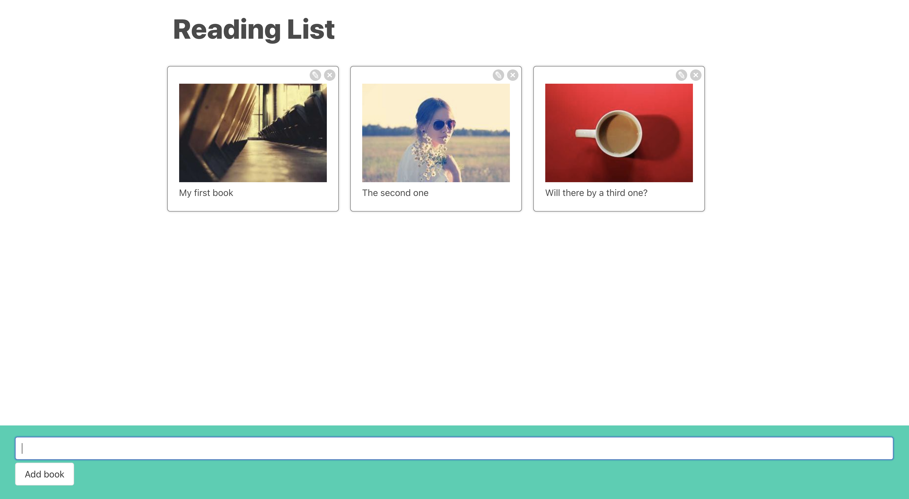

# React_Reading_Books

Repository created following this [Udemy Course](https://www.udemy.com/course/react-redux/) to practice the following basic React concepts:

- Advanced comunication between components.
- Advanced handling of forms.
- Context.
- Initial glance at hooks.
- Data persistance.

## Application

Application has an input to type the name of a book. Once you hit enter / click Save, a new tile will be displayed with the book title and a random image. You can remove & edit the already existing tiles. To persist the information, json-server package is being used.



## Run Locally

Clone the project

```bash
  git clone https://github.com/pedrolopezbiedma/React_Reading_Books.git
```

Install dependencies

```bash
  npm install
```

Start the server in another console

```bash
  npm run server
```

Start the application

```bash
  npm run start
```

## Authors

- [@pedrolopezbiedma](https://github.com/pedrolopezbiedma)
